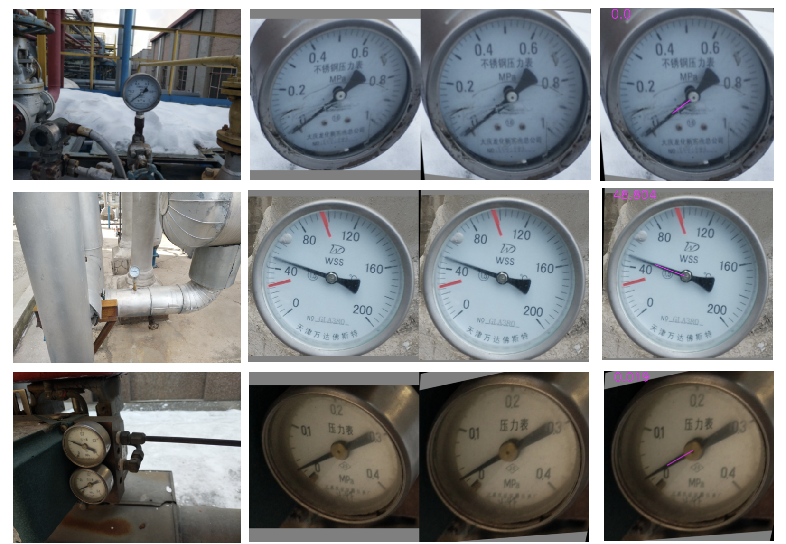

# A three-stage detection and recognition pipeline of complex meters in wild
This is the first released system towards detection and recognition of complex meters in wild. The system can be divided into three moduels. Fisrtly, a yolo-based detector is applied to get pure meter region. Secondly, a spatial transformer module is eatablished to rectify the position of meter. Lastly, an end-to-end network is to read meter values, which is implemented by pointer/dail predcition and key number learning.    

## Visulization results



Left row is the original image, middle row is the process of meter rectification, right row is the result of meter value reading.


## ToDo List

- [x] Release testing code
- [ ] Release training code and dataset(after paper release)
- [x] existing three-stage models
- [ ] A new end-to-end model for image distoration and meter value reading
- [ ] A new branch for digital-meter recognition
- [x] Document for testing
- [ ] Document for training(after paper release)
- [x] Demo script for single image
- [ ] Demo script for video
- [ ] Evaluation


## Installation

### Requirements:
- Python3 (Python3.7 is recommended)
- PyTorch >= 1.0 
- torchvision from master
- numpy
- skimage
- OpenCV==3.0.x
- CUDA >= 9.0 (10.0 is recommended)

## Models
Download Trained [model](https://drive.google.com/drive/folders/1juFFjBz9BlJEuLc_IxFj5RUz0Z_UfO0M?usp=sharing)

Please put distro_net.pt into meter_distro/weight.  
put textgraph_vgg_450.pth into model/meter_data.

## Demo 
You can run a demo script for a single image inference by two steps.

```python get_meter_area.py```. and the detected meter will be stored in scene_image_data/deteced_meter

```python predict.py``` to get distored meter and final result.


